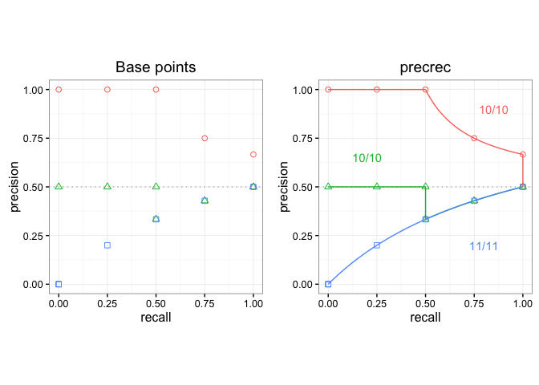
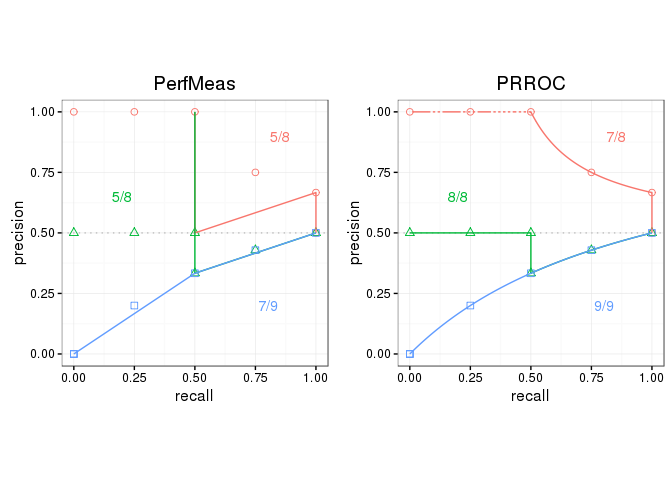

<!-- README.md is generated from README.Rmd. Please edit that file -->
prcbench
========

[](https://travis-ci.org/takayasaito/prcbench)

The aim of `prcbench` is to provide a testing workbench for evaluating Precision-Recall curves under various conditions. It contains integrated interfaces for the following five different tools as well as predefined test data sets.

| Tool          | Link                                                |
|---------------|-----------------------------------------------------|
| ROCR          | [CRAN](https://cran.r-project.org/package=ROCR)     |
| AUCCalculator | [Web site](http://mark.goadrich.com/package=AUC)    |
| PerfMeas      | [CRAN](https://cran.r-project.org/package=PerfMeas) |
| PRROC         | [CRAN](https://cran.r-project.org/package=PRROC)    |
| precrec       | [CRAN](https://cran.r-project.org/package=precrec)  |

Installation
------------

Only a development version of `prcbench` is currently available at [our GitHub repository](https://github.com/takayasaito/prcbench).

To install it:

1.  Make sure you have a working development environment.
    -   **Windows**: Install [Rtools](http://cran.r-project.org/bin/windows/Rtools/).
    -   **Mac**: Install Xcode from the Mac App Store.
    -   **Linux**: Install a compiler and various development libraries (details vary across different flavors of Linux).

2.  Install required Bioconductor packages for `PerfMeas`.

        ## try http:// if https:// URLs are not supported
        source("https://bioconductor.org/biocLite.R")
        biocLite("limma")
        biocLite("graph")
        biocLite("RBGL")

3.  Install `devtools` from CRAN with `install.packages("devtools")`.

4.  Install `prcbench` from the GitHub repository with `devtools::install_github("/takayasaito/prcbench")`

Documentation
-------------

A package vignette - Introduction to prcbench - contains the descriptions of the functions with several useful examples. View the vignette with `vignette("introduction", package = "prcbench")`.

In addition, all the main functions have their own help pages with examples.

Examples
--------

Following two examples show the basic usage of `prcbench` functions.

### Benchmarking

The `run_benchmark` function outputs the result of [microbenchmark](https://cran.r-project.org/package=microbenchmark) for specified tools.

``` r
## Load library
library(prcbench)

## Run microbenchmark for aut5 on b10
testset <- create_testset("bench", "b10")
toolset <- create_toolset(set_names = "auc5")
res <- run_benchmark(testset, toolset)

## Use knitr::kable to show the result in a table format
knitr::kable(res$tab, digits = 2)
```

| testset | toolset | toolname      |    min|     lq|   mean|  median|     uq|     max|  neval|
|:--------|:--------|:--------------|------:|------:|------:|-------:|------:|-------:|------:|
| b10     | auc5    | ROCR          |   3.09|   3.12|  15.12|    3.21|   3.22|   62.98|      5|
| b10     | auc5    | AUCCalculator |  60.88|  61.22|  63.12|   61.46|  62.30|   69.72|      5|
| b10     | auc5    | PerfMeas      |   0.08|   0.09|  92.43|    0.09|   0.11|  461.78|      5|
| b10     | auc5    | PRROC         |   2.67|   2.77|   4.09|    2.83|   2.96|    9.23|      5|
| b10     | auc5    | precrec       |   6.63|   6.63|  10.90|    6.84|   7.04|   27.35|      5|

### Evaluation of Precision-Recall curves

The `run_evalcurve` function evaluates Precision-Recall curves with predefined test datasets. The `autoplot` shows a plot with the result of the `run_evalcurve` function.

``` r
## ggplot2 is necessary to use autoplot
library(ggplot2)

## Plot base points and the result of precrec on c1, c2, and c3 test sets
testset <- create_testset("curve", c("c1", "c2", "c3"))
toolset <- create_toolset("precrec")
scores1 <- run_evalcurve(testset, toolset)
autoplot(scores1)
```



``` r
## Plot the results of PerfMeas and PRROC on c1, c2, and c3 test sets
toolset <- create_toolset(c("PerfMeas", "PRROC"))
scores2 <- run_evalcurve(testset, toolset)
autoplot(scores2, base_plot = FALSE)
```


