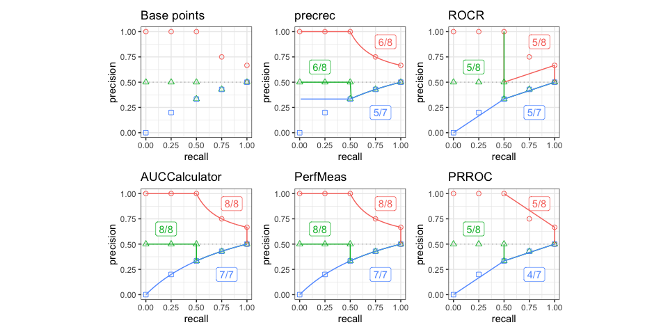

# prcbench 

[](https://github.com/evalclass/prcbench/actions/workflows/R-CMD-check.yaml)
[](https://ci.appveyor.com/project/takayasaito/prcbench/)
[](https://codecov.io/github/evalclass/prcbench?branch=main)
[](https://www.codefactor.io/repository/github/evalclass/prcbench/)
[](https://cran.r-project.org/package=prcbench)
[](https://cran.r-project.org/package=prcbench)

The aim of the `prcbench` package is to provide a testing workbench for
evaluating precision-recall curves under various conditions. It contains
integrated interfaces for the following five tools. It also contains
predefined test data sets.

| Tool          | Link                                                                                                      |
|---------------|-----------------------------------------------------------------------------------------------------------|
| ROCR          | [Tool web site](https://ipa-tys.github.io/ROCR/), [CRAN](https://cran.r-project.org/package=ROCR)         |
| AUCCalculator | [Tool web site](http://mark.goadrich.com/programs/AUC/)                                                   |
| PerfMeas      | [CRAN](https://cran.r-project.org/package=PerfMeas)                                                       |
| PRROC         | [CRAN](https://cran.r-project.org/package=PRROC)                                                          |
| precrec       | [Tool web site](https://evalclass.github.io/precrec/), [CRAN](https://cran.r-project.org/package=precrec) |

## Documentation

-   [Introduction to
    prcbench](https://evalclass.github.io/prcbench/articles/introduction.html)
    – a package vignette that contains the descriptions of the functions
    with several useful examples. View the vignette with
    `vignette("introduction", package = "prcbench")` in R. The HTML
    version is also available on the [GitHub
    Pages](https://evalclass.github.io/prcbench/articles/introduction.html).

-   [Help pages](https://evalclass.github.io/prcbench/reference/) – all
    the functions including the S3 generics have their own help pages
    with plenty of examples. View the main help page with
    `help(package = "prcbench")` in R. The HTML version is also
    available on the [GitHub
    Pages](https://evalclass.github.io/prcbench/reference/).

## Dependencies

### Java

`AUCCalculator` requires a Java runtime (\>= 6).

## Installation

-   Install the release version of `prcbench` from CRAN with
    `install.packages("prcbench")`.

-   Alternatively, you can install a development version of `prcbench`
    from [our GitHub repository](https://github.com/evalclass/prcbench).
    To install it:

    1.  Make sure you have a working development environment.

        -   **Windows**: Install Rtools (available on the CRAN website).
        -   **Mac**: Install Xcode from the Mac App Store.
        -   **Linux**: Install a compiler and various development
            libraries (details vary across different flavors of Linux).

    2.  Install `devtools` from CRAN with
        `install.packages("devtools")`.

    3.  Install `prcbench` from the GitHub repository with
        `devtools::install_github("evalclass/prcbench")`.

## Troubleshooting

### microbenchmark

[microbenchmark](https://cran.r-project.org/package=microbenchmark) does
not work on some OSs. `prcbench` uses `system.time` when
`microbenchmark` is not available.

### rJava

-   Some OSs require further configuration for rJava.

<!-- -->

    sudo R CMD javareconf

-   JDKs for macOS Big Sur.

1.  [AdoptOpenJDK](https://adoptopenjdk.net/)
2.  [AdoptOpenJDK with
    homebrew](https://github.com/AdoptOpenJDK/homebrew-openjdk/)
3.  [Oracle JDK](https://www.oracle.com/java/)

-   JRI support on macOS Big Sur – see this [Stack Overflow
    thread](https://stackoverflow.com/questions/65278552/cannot-install-rjava-on-big-sur).

``` r
install.packages("rJava", configure.args="--disable-jri")
```

## Examples

Following two examples show the basic usage of `prcbench` functions.

### Benchmarking

The `run_benchmark` function outputs the result of
[microbenchmark](https://cran.r-project.org/package=microbenchmark) for
specified tools.

``` r
## Load library
library(prcbench)

## Run microbenchmark for auc5 (five tools) on b10 (balanced 5 Ps and 5 Ns)
testset <- create_testset("bench", "b10")
toolset <- create_toolset(set_names = "auc5")
res <- run_benchmark(testset, toolset)

## Use knitr::kable to show the result in a table format
knitr::kable(res$tab, digits = 2)
```

| testset | toolset | toolname      |  min |   lq |  mean | median |    uq |    max | neval |
|:--------|:--------|:--------------|-----:|-----:|------:|-------:|------:|-------:|------:|
| b10     | auc5    | AUCCalculator | 5.00 | 5.29 |  9.17 |   5.36 |  8.46 |  21.75 |     5 |
| b10     | auc5    | PerfMeas      | 0.19 | 0.22 |  0.48 |   0.27 |  0.35 |   1.36 |     5 |
| b10     | auc5    | precrec       | 4.93 | 5.11 | 25.72 |   5.69 |  5.69 | 107.18 |     5 |
| b10     | auc5    | PRROC         | 0.49 | 0.58 |  2.88 |   0.76 |  1.20 |  11.35 |     5 |
| b10     | auc5    | ROCR          | 3.39 | 3.51 | 14.17 |   3.99 | 19.85 |  40.09 |     5 |

### Evaluation of precision-recall curves

The `run_evalcurve` function evaluates precision-recall curves with
predefined test datasets. The `autoplot` shows a plot with the result of
the `run_evalcurve` function.

<!-- -->

## Citation

*Precrec: fast and accurate precision-recall and ROC curve calculations
in R*

Takaya Saito; Marc Rehmsmeier

Bioinformatics 2017; 33 (1): 145-147.

doi:
[10.1093/bioinformatics/btw570](https://doi.org/10.1093/bioinformatics/btw570)

## External links

-   [Classifier evaluation with imbalanced
    datasets](https://classeval.wordpress.com/) – our web site that
    contains several pages with useful tips for performance evaluation
    on binary classifiers.

-   [The Precision-Recall Plot Is More Informative than the ROC Plot
    When Evaluating Binary Classifiers on Imbalanced
    Datasets](https://journals.plos.org/plosone/article?id=10.1371/journal.pone.0118432)
    – our paper that summarized potential pitfalls of ROC plots with
    imbalanced datasets and advantages of using precision-recall plots
    instead.
