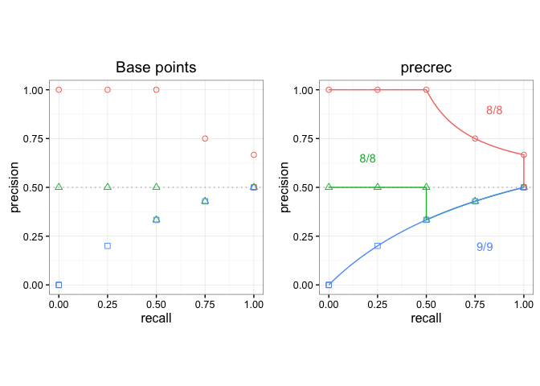
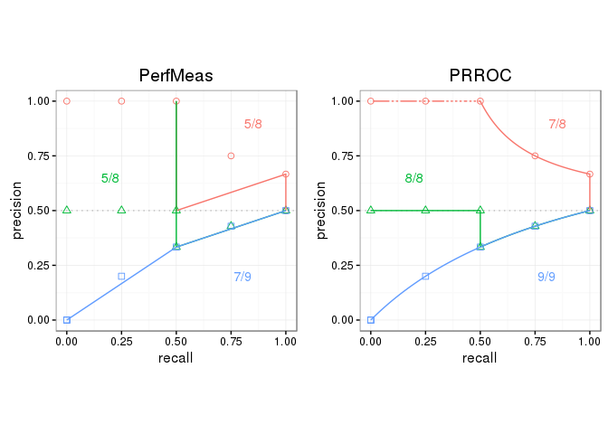

prcbench
========

[](https://travis-ci.org/takayasaito/prcbench) [](http://cran.r-project.org/package=prcbench)

The aim of `prcbench` is to provide a testing workbench for evaluating Precision-Recall curves under various conditions. It contains integrated interfaces for the following five tools. It also contains predefined test data sets.

| Tool          | Link                                                |
|---------------|-----------------------------------------------------|
| ROCR          | [CRAN](https://cran.r-project.org/package=ROCR)     |
| AUCCalculator | [Web site](http://mark.goadrich.com/package=AUC)    |
| PerfMeas      | [CRAN](https://cran.r-project.org/package=PerfMeas) |
| PRROC         | [CRAN](https://cran.r-project.org/package=PRROC)    |
| precrec       | [CRAN](https://cran.r-project.org/package=precrec)  |

Dependencies
------------

### Java

`AUCCalculator` requires a Java runtime (\>= 7).

### Bioconductor libraries

`PerfMeas` requires Bioconductor libraries. To automatically install the dependencies, add a Bioconductor repository to the list as:

``` r
## Include a Bioconductor repository
setRepositories(ind = 1:2)
```

Installation
------------

-   Install the release version of `prcbench` from CRAN with `install.packages("prcbench")`.

-   Alternatively, you can install a development version of `prcbench` from [our GitHub repository](https://github.com/takayasaito/prcbench). To install it:

    1.  Make sure you have a working development environment.
        -   **Windows**: Install [Rtools](http://cran.r-project.org/bin/windows/Rtools/).
        -   **Mac**: Install Xcode from the Mac App Store.
        -   **Linux**: Install a compiler and various development libraries (details vary across different flavors of Linux).

    2.  Install `devtools` from CRAN with `install.packages("devtools")`.

    3.  Install `prcbench` from the GitHub repository with `devtools::install_github("/takayasaito/prcbench")`.

Potential installation issues
-----------------------------

### Bioconductor libraries

You can manually install the dependencies from Bioconductor if `install.packages` fails to access the Bioconductor repository.

``` r
## try http:// if https:// URLs are not supported
source("https://bioconductor.org/biocLite.R")
biocLite("limma")
biocLite("graph")
biocLite("RBGL")
```

### rJava

Some OSs require further configuration for rJava.

Use:

``` r
Sys.setenv(JAVA_HOME = "<path to JRE>")
```

or

    #!/bin/bash

    export JAVA_HOME = "<path to JRE>"
    R CMD javareconf

### microbenchmark

[microbenchmark](https://cran.r-project.org/package=microbenchmark) does not work on some OSs. `prcbench` uses `system.time` when `microbenchmark` is not available.

Documentation
-------------

A package vignette - Introduction to prcbench - contains the descriptions of the functions with several useful examples. View the vignette with `vignette("introduction", package = "prcbench")`.

In addition, all the main functions have their own help pages with examples.

Examples
--------

Following two examples show the basic usage of `prcbench` functions.

### Benchmarking

The `run_benchmark` function outputs the result of [microbenchmark](https://cran.r-project.org/package=microbenchmark) for specified tools.

``` r
## Load library
library(prcbench)

## Run microbenchmark for aut5 on b10
testset <- create_testset("bench", "b10")
toolset <- create_toolset(set_names = "auc5")
res <- run_benchmark(testset, toolset)

## Use knitr::kable to show the result in a table format
knitr::kable(res$tab, digits = 2)
```

| testset | toolset | toolname      |    min|     lq|   mean|  median|     uq|     max|  neval|
|:--------|:--------|:--------------|------:|------:|------:|-------:|------:|-------:|------:|
| b10     | auc5    | ROCR          |   3.14|   3.27|  18.22|    3.43|   5.80|   75.43|      5|
| b10     | auc5    | AUCCalculator |  61.62|  63.11|  64.67|   63.35|  64.63|   70.62|      5|
| b10     | auc5    | PerfMeas      |   0.09|   0.09|  96.43|    0.09|   0.11|  481.79|      5|
| b10     | auc5    | PRROC         |   2.38|   2.41|   4.04|    2.44|   2.52|   10.48|      5|
| b10     | auc5    | precrec       |   6.97|   7.05|  11.13|    7.08|   7.12|   27.42|      5|

### Evaluation of Precision-Recall curves

The `run_evalcurve` function evaluates Precision-Recall curves with predefined test datasets. The `autoplot` shows a plot with the result of the `run_evalcurve` function.

``` r
## ggplot2 is necessary to use autoplot
library(ggplot2)

## Plot base points and the result of precrec on c1, c2, and c3 test sets
testset <- create_testset("curve", c("c1", "c2", "c3"))
toolset <- create_toolset("precrec")
scores1 <- run_evalcurve(testset, toolset)
autoplot(scores1)
```



``` r
## Plot the results of PerfMeas and PRROC on c1, c2, and c3 test sets
toolset <- create_toolset(c("PerfMeas", "PRROC"))
scores2 <- run_evalcurve(testset, toolset)
autoplot(scores2, base_plot = FALSE)
```



External links
--------------

See our website - [Classifier evaluation with imbalanced datasets](https://classeval.wordpress.com/) - for useful tips for performance evaluation on binary classifiers. In addition, we have summarized potential pitfalls of ROC plots with imbalanced datasets. See our paper - [The Precision-Recall Plot Is More Informative than the ROC Plot When Evaluating Binary Classifiers on Imbalanced Datasets](http://journals.plos.org/plosone/article?id=10.1371/journal.pone.0118432) - for more details.
